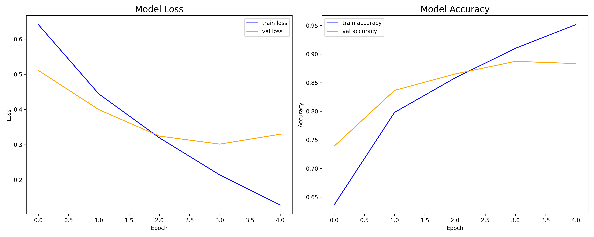

# 🎭 Face Mask Detection System

An AI-powered web application that uses computer vision and deep learning to detect whether a person is wearing a face mask or not. The system provides both image upload and real-time camera detection capabilities with high accuracy.



## 🚀 Features

- **Real-time Detection**: Live camera feed with instant mask detection
- **Image Upload**: Batch processing for uploaded images
- **High Accuracy**: 95.10% accuracy on test dataset
- **Professional UI**: Clean, responsive web interface
- **Confidence Scoring**: Detailed confidence scores for predictions
- **Cross-platform**: Works on desktop and mobile devices

## 📊 Model Performance

### Training Results

- **Training Accuracy**: 95.93%
- **Validation Accuracy**: 88.35%
- **Training Loss**: 0.1157
- **Validation Loss**: 0.3296

### Test Results Summary

- **Total Images Tested**: 1,000
- **Correct Predictions**: 951
- **Incorrect Predictions**: 49
- **Test Accuracy**: **95.10%**

## 🛠️ Technology Stack

- **Backend**: Flask
- **Machine Learning**: TensorFlow, Keras
- **Computer Vision**: OpenCV
- **Frontend**: HTML5, CSS3, JavaScript
- **Face Detection**: Haar Cascade Classifiers
- **Model Architecture**: Convolutional Neural Network (CNN)

## 📁 Project Structure

```
face-mask-alert-system/
├── app.py                              # Main Flask application
├── model/
│   └── face_mask_detection.h5         # Trained model file
├── static/
│   └── css/
│       ├── index.css                   # Home page styles
│       └── styles.css                  # Application styles
├── templates/
│   ├── index.html                      # Home page
│   ├── upload_image.html              # Image upload page
│   ├── live_test.html                 # Live camera page
│   └── about.html                     # About page
├── src/
│   ├── train.py                       # Model training script
│   ├── test.py                        # Model testing script
│   └── live_test.py                   # Live detection script
├── data/                              # Training dataset
│   ├── with_mask/                     # Images with masks
│   └── without_mask/                  # Images without masks
├── logs/                              # Training logs
├── haarcascade_frontalface_default.xml # Face detection classifier
└── README.md                         # Project documentation
```

## 🔧 Installation & Setup

### Prerequisites

- Python 3.8 or higher
- pip package manager
- Webcam (for live detection)

### Installation Steps

1. **Clone the repository**

   ```bash
   git clone <repository-url>
   cd face-mask-alert-system
   ```
2. **Install required packages**

   ```bash
   pip install flask tensorflow opencv-python numpy pillow
   ```
3. **Download the model** (if not included)

   - Ensure `face_mask_detection.h5` is in the `model/` directory
   - If missing, run the training script: `python src/train.py`
4. **Download Haar Cascade file**

   - Ensure `haarcascade_frontalface_default.xml` is in the root directory
   - Download from OpenCV repository if missing

## 🚀 Usage

### Running the Application

1. **Start the Flask server**

   ```bash
   python app.py
   ```
2. **Open your browser**

   - Navigate to `http://localhost:5000`
   - Grant camera permissions when prompted

### Features Usage

#### 📸 Image Upload Detection

1. Click "Upload Image" on the home page
2. Select or drag & drop an image file
3. View instant detection results with confidence scores
4. See visual feedback with bounding boxes

#### 📹 Live Camera Detection

1. Click "Live Camera Test" on the home page
2. Grant camera permissions
3. Click "Start Camera" to begin detection
4. Real-time results appear on the right side
5. Click "Stop Camera" when finished

## 🧠 Model Details

### Architecture

- **Input Size**: 256x256 grayscale images
- **Model Type**: Convolutional Neural Network (CNN)
- **Framework**: TensorFlow/Keras
- **Face Detection**: Haar Cascade Classifiers

### Training Dataset

- **Total Images**: Thousands of labeled images
- **Classes**: 2 (with_mask, without_mask)
- **Data Augmentation**: Applied for better generalization
- **Split**: 80% training, 20% validation

### Preprocessing Pipeline

1. Face detection using Haar Cascade
2. Region of Interest (ROI) extraction
3. Grayscale conversion
4. Resize to 256x256 pixels
5. Normalization (pixel values 0-1)

## 📈 Performance Metrics

| Metric              | Value            |
| ------------------- | ---------------- |
| Training Accuracy   | 95.93%           |
| Validation Accuracy | 88.35%           |
| Test Accuracy       | **95.10%** |
| Training Loss       | 0.1157           |
| Validation Loss     | 0.3296           |
| Correct Predictions | 951/1000         |

## 🔄 API Endpoints

### Web Routes

- `GET /` - Home page
- `GET /upload` - Image upload page
- `GET /live-test` - Live camera page
- `GET /about` - About page

### API Routes

- `POST /image-test` - Upload image for detection
- `GET /video_feed` - Live camera stream
- `GET /stop_camera` - Stop camera stream

## 🛡️ Error Handling

The application includes comprehensive error handling for:

- Invalid image formats
- Camera access issues
- Model loading errors
- Network connectivity problems
- File upload limitations

## 🎨 UI/UX Features

- **Professional Design**: Clean, modern interface
- **Responsive Layout**: Works on all device sizes
- **Toast Notifications**: Real-time feedback messages
- **Loading States**: Visual feedback during processing
- **Accessibility**: Screen reader friendly
- **Cross-browser**: Compatible with major browsers

## 🔧 Configuration

### Model Configuration

```python
# Image preprocessing settings
IMG_SIZE = (256, 256)
CHANNELS = 1  # Grayscale
BATCH_SIZE = 32
```

### Camera Settings

```python
# Camera capture settings
CAMERA_INDEX = 0  # Default camera
FRAME_WIDTH = 640
FRAME_HEIGHT = 480
```

## 🚀 Deployment

### Local Development

```bash
python app.py
# Runs on http://localhost:5000 with debug mode
```

### Production Deployment

```bash
# Using Gunicorn
pip install gunicorn
gunicorn -w 4 -b 0.0.0.0:5000 app:app
```

## 🤝 Contributing

1. Fork the repository
2. Create a feature branch (`git checkout -b feature/improvement`)
3. Commit changes (`git commit -am 'Add new feature'`)
4. Push to branch (`git push origin feature/improvement`)
5. Create a Pull Request

## 🔧 Troubleshooting

### Common Issues

**Model file not found**

```bash
# Solution: Ensure model file exists
ls model/face_mask_detection.h5
# If missing, run training script
python src/train.py
```

**Camera not working**

```bash
# Check camera permissions in browser
# Ensure camera is not being used by other applications
# Try different camera index in app.py
```

**Low accuracy on custom images**

```bash
# Ensure good lighting conditions
# Face should be clearly visible
# Image quality should be reasonable
```

---

⭐ **Star this repository if you found it helpful!**

Made with ❤️ by [Sai Dhinakar](github.com/SaiDhinakar)
